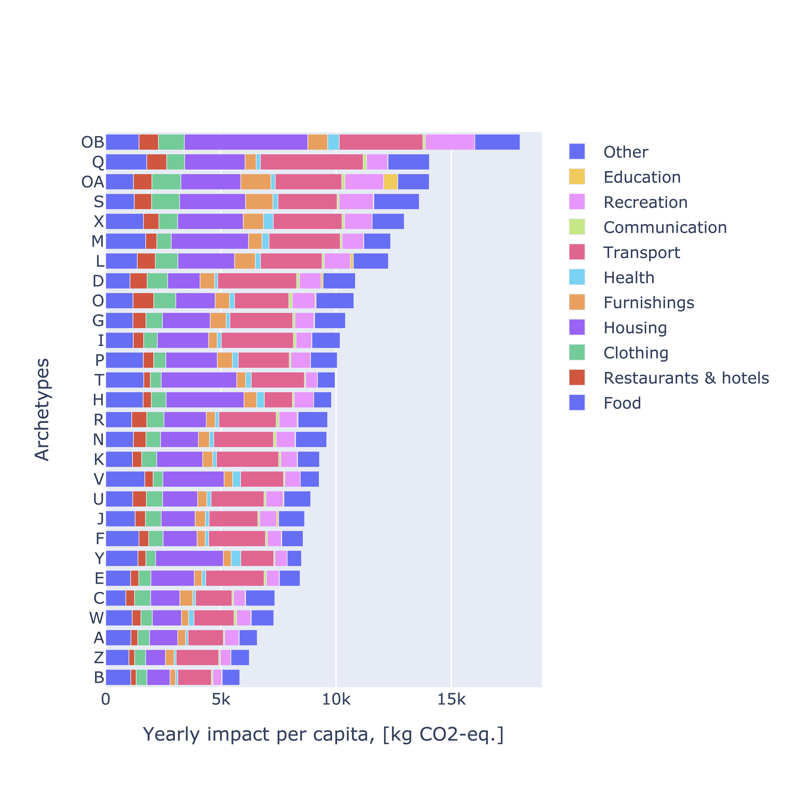
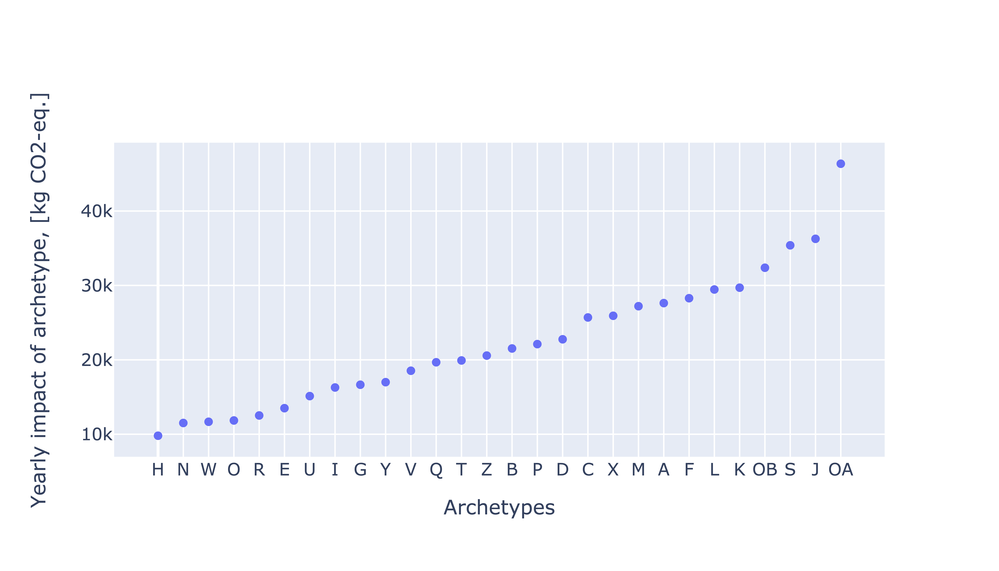

Welcome to consumption_model_ch!
================================

This package reproduces the consumption model developed by Dr. Andreas Froemelt et al. in the paper "Using Data Mining To Assess Environmental Impacts of Household Consumption Behaviors", [doi:10.1021/acs.est.8b01452](https://dx.doi.org/10.1021/acs.est.8b01452). 

The model is based on the Swiss household expenditure surveys conducted by the Federal Office of Statistics in years 2009-2011, 2012-2014 and 2015-2016. It contains foreground inventories for Swiss household consumption activities, as well as functional units for the households participated in the survey, and for the household archetypes as described in the paper.

Note that, the original model was implemented only for the years 2009-2011. This package updates it for 2012-2014, 2015-2017 surveys and for background databases, namely Ecoinvent 3.8 cutoff, Agribalyse 1.3 and Exiobase 3.8.1 monetary. 

Results
=======

